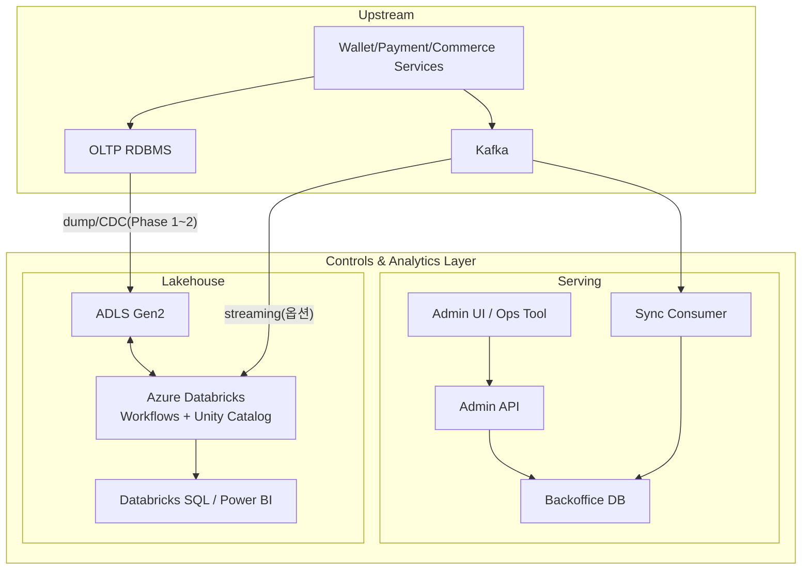
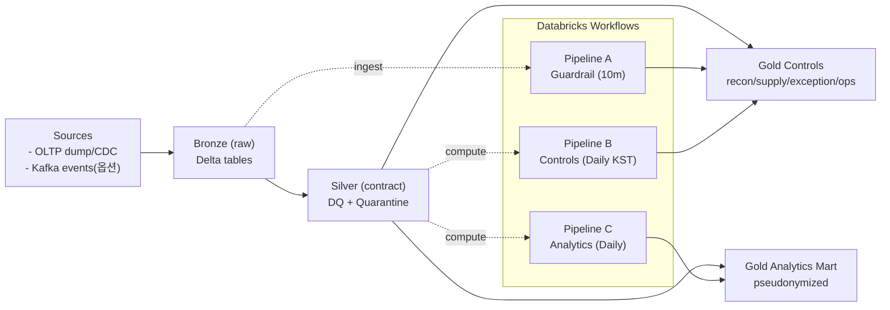
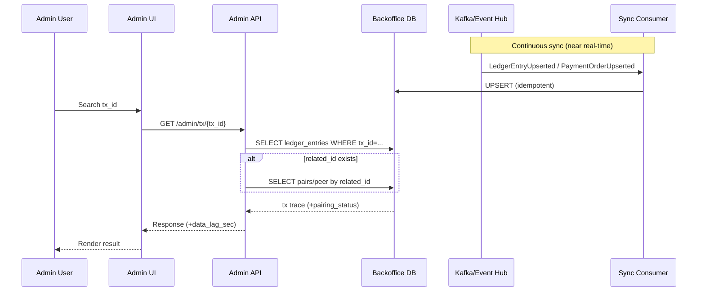
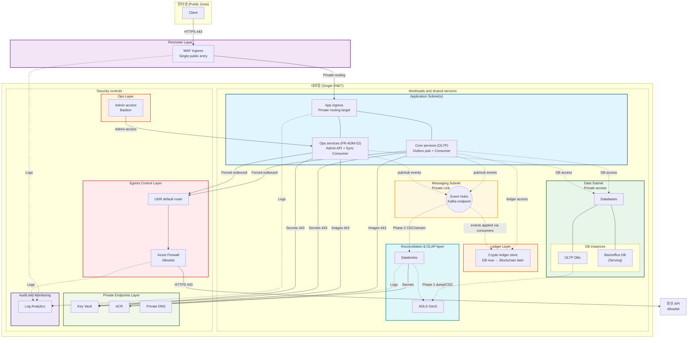

# Controls & Analytics Layer 아키텍처 (Azure) — NSC Platform (SRS 2.3/2.4)

> **Controls & Analytics Layer 정의(본 프로젝트)**: SRS **2.3(원장 및 관리자)**, **2.4(Analytics - OLAP)** 범위를 통칭  
> **Updated**: 2026-02-04  
> **근거 문서(현재 디렉토리)**: `SRS - Software Requirements Specification.md`, `databricks_project_specs.md`, `data_contract.md`, `backoffice_project_specs.md`, `backoffice_db_admin_api.md`, `backoffice_data_project.md`, `database_schema`

---

## 1) 범위 / 시스템 경계

### 1.1 In-scope (Controls & Analytics Layer)

- **FR-ADM-01**: 총 발행량(issued supply) ↔ 사용자 잔액 총합 정합성(일배치 검증)
- **FR-ADM-02**: `tx_id` 기반 거래 내역 추적(초 단위 조회는 Serving Layer)
- **FR-ADM-03**: 일일 대사(Δ잔고 = 순흐름) 및 불일치 리포팅
- **FR-ANA-01(P3)**: 결제/주문 데이터 익명화 적재(OLAP)
- **FR-ANA-02(P3)**: 시세 모니터링(옵션)

### 1.2 Out-of-scope (업스트림/거래 처리 계층)

- Freeze/Settle/Rollback 등 **트랜잭션 처리** 및 ACID 원장 기록(SRS 2.1/2.2)
- 고객-facing 실시간 처리 SLA(Controls & Analytics Layer는 배치/준실시간 중심)

---

## 2) 요구사항 ↔ 구현 위치(요약)

| SRS | 요구사항 | 구현 위치 | Azure 주요 구성요소 | 핵심 산출물/인터페이스 |
|---|---|---|---|---|
| FR-ADM-01 | 발행량 ↔ 잔액 합 검증 | Lakehouse | ADLS Gen2 + Azure Databricks | `gold.ledger_supply_balance_daily`, `gold.exception_ledger` |
| FR-ADM-02 | `tx_id` 거래 추적(초 단위) | Serving | Event Hubs(Kafka) + Consumer + PostgreSQL + Admin API | `GET /admin/tx/{tx_id}` |
| FR-ADM-03 | 일일 대사(자정) | Lakehouse | ADLS Gen2 + Azure Databricks | `gold.recon_daily_snapshot_flow`, `gold.exception_ledger` |
| FR-ANA-01 | 결제 패턴 수집(익명화) | Lakehouse | Databricks(ETL) + Databricks SQL/Power BI | `gold.fact_payment_anonymized` |
| FR-ANA-02 | 시세 모니터링 | Lakehouse(옵션) | Functions/Container Apps + Databricks | `gold.fact_market_price`(옵션) |

---

## 3) 전체 아키텍처(논리 뷰)

### 3.1 Azure 서비스로 운영할 때의 구성(운영 뷰)

운영 시에는 아래 조합을 기본값으로 둔다.

| 영역 | 논리 컴포넌트 | Azure 권장 서비스 | 비고 |
|---|---|---|---|
| Lakehouse | 데이터 저장(Bronze/Silver/Gold) | **Storage Account (ADLS Gen2)** | Delta Lake 저장소(Private Endpoint 권장) |
| Lakehouse | ETL/배치 실행 | **Azure Databricks (Workflows/Jobs)** | Unity Catalog 권한 분리, Workflows로 스케줄/재시도 |
| Lakehouse | SQL/리포팅 | **Databricks SQL** / **Power BI** | 운영 통제/OLAP 조회 |
| Ingestion | 초기 덤프/백필 | **Azure Data Factory**(또는 배치 Export Job) | Phase 1(초기 운영) |
| Ingestion | CDC/스트리밍(옵션) | **Azure Event Hubs (Kafka endpoint)** + **Databricks Streaming/Auto Loader** | Phase 2(고도화) |
| Serving | 이벤트 소비/동기화 | **Azure Container Apps** | `Sync Consumer`(min replicas 1 권장) |
| Serving | Admin API | **Azure Container Apps** | FR-ADM-02 조회, RBAC/감사로그 |
| Serving | Serving DB | **Azure Database for PostgreSQL (Flexible Server)** | Backoffice DB(인덱스/조회 최적화) |
| Container | 이미지 저장 | **Azure Container Registry (ACR)** | CI/CD 산출물 |
| Identity | 인증/권한 | **Microsoft Entra ID(Azure AD)** | Admin SSO, 서비스 간 Managed Identity |
| Secrets | 시크릿/가명처리 salt | **Azure Key Vault** | Databricks Secret Scope 연동 |
| Network | 단일 진입점(WAF) | **Front Door WAF** 또는 **Application Gateway WAF** | “단일 공개 진입점” 원칙 |
| Network | Private access | **Private Endpoint + Private DNS** | ADLS/KV/ACR/DB/Event Hubs 등 |
| Network | Egress 통제 | **UDR + Azure Firewall** | allowlist 기반 outbound |
| Ops | 운영자 접속 | **Azure Bastion** | 공인 IP 최소화 |
| Observability | 로그/메트릭/트레이싱 | **Azure Monitor + Log Analytics + Application Insights** | 진단 설정으로 중앙 수집/알림 |

---

## 4) Lakehouse(Controls & Analytics) — ADLS Gen2 + Azure Databricks

### 4.1 데이터 레이어(권장)

- **Bronze**: 원본 보존(덤프/CDC/Kafka 이벤트) → 스키마 에볼루션 허용(원본 최대 보존)
- **Silver**: `data_contract.md` 기반 스키마 강제 + DQ/격리(fail-fast/Quarantine)
- **Gold**: 운영 통제 산출물 + 익명화된 분석 마트

핵심 테이블(예시)
- 통제(2.3): `gold.recon_daily_snapshot_flow`, `gold.ledger_supply_balance_daily`, `gold.exception_ledger`
- 운영 지표: `gold.ops_payment_failure_daily`, `gold.ops_ledger_pairing_quality_daily`, `gold.pipeline_state`
- 분석(2.4): `gold.fact_payment_anonymized`(PII 제거 + `user_key` 가명처리)

### 4.2 Ingestion(단계형 권장)

- **Phase 1 (개발/초기 운영)**: OLTP → ADLS 덤프(ADF/Export job) → Databricks 배치 적재
- **Phase 2 (운영 고도화)**: OLTP CDC(Debezium 등) 또는 Kafka 이벤트 → Databricks(Streaming/Auto Loader) → Bronze
- **옵션(준실시간)**: 원장/결제 이벤트 토픽을 Structured Streaming으로 Bronze에 적재(운영 필요 시)

### 4.3 Workflows/Jobs (스케줄 요약)

- **Pipeline A — Guardrail(DQ, 10분)**: freshness/completeness/duplicates/contract 검사 → `silver.dq_status`, `gold.exception_ledger`
- **Pipeline B — Controls(일일, KST 00:05~00:15)**: 일일 대사 + 총량 정합성 → `gold.recon_daily_snapshot_flow`, `gold.ledger_supply_balance_daily`
- **Pipeline C — Analytics(일배치)**: 결제/주문 익명화 마트 생성 → `gold.fact_payment_anonymized`

### 4.4 운영/리스크 포인트(데이터 계약 관점)

현재 `database_schema` 기준으로 Controls & Analytics Layer(2.3/2.4)에서 특히 중요한 보강/합의 포인트:

- `transaction_ledger`에 **부호(±)** 정보가 없음 → `amount_signed`를 업스트림 제공 또는 `type(entry_type)`→부호 룰을 **테이블(룰)로 관리**
- sender/receiver가 직접 컬럼으로 없음 → 결제 더블엔트리(PAYMENT/RECEIVE)를 `related_id`로 **페어링**해 파생(또는 업스트림 제공)
- `payment_orders.updated_at/version` 부재 시: out-of-order 이벤트에 취약 → 이벤트에 `updated_at`/`version` 포함 권장

### 4.5 확장 전략(OLAP 요구사항 추가 시)

- OLAP(Analytics) 영역은 **아이디어/지표 논의(운영·비즈니스 질문 정의) 후** 우선순위를 확정하고 단계적으로 확장한다.
- 새로운 OLAP 분석 요구사항이 생기면 **Gold 레이어에 테이블(또는 뷰)을 추가**하여 확장한다.
  - 예: 신규 팩트/집계(`gold.fact_*`, `gold.mart_*`) 또는 신규 차원(`gold.dim_*`)
- 기존 Silver 계약(`data_contract.md`)은 가능한 한 **안정적으로 유지**하고, Gold에서 파생/조합을 통해 요구사항을 흡수한다.
- Gold 확장 시 운영 원칙
  - 스키마는 고정(계약 기반)하고, 변경은 버전업(필요 시 SCD2/룰 버전)으로 관리
  - PII 미적재/가명처리 원칙 준수(`user_key`, `salt`는 Key Vault)
  - Unity Catalog 권한을 “운영 통제 산출물”과 “분석 마트”로 분리(접근 최소화)
  - Databricks Workflows(Pipeline C)에 Job/Task를 추가하고, DAB로 환경별 배포(IaC)

---

## 5) Serving Layer(FR-ADM-02) — 초 단위 거래 추적

### 5.1 구성요소(권장)

- **Event Bus**: Kafka(또는 Azure Event Hubs Kafka endpoint)
- **Sync Consumer**: 이벤트 consume → Backoffice DB에 upsert(멱등) + DLQ/재처리
- **Backoffice DB**: 조회 최적화 RDBMS (Azure Database for PostgreSQL Flexible Server 권장)
- **Admin API**: `GET /admin/tx/{tx_id}` (p95 200ms 목표), RBAC/감사로그 필수

### 5.2 데이터 흐름(요약)

---

## 6) 보안/네트워크/거버넌스(권장 베이스라인)

### 6.1 Identity & Secrets

- **Azure AD**: Admin 사용자 SSO + RBAC(`ADMIN_READ`, `ADMIN_AUDIT` 등)
- **Managed Identity**: Databricks/Container Apps → Key Vault, ADLS, DB 접근
- **Key Vault**: DB 커넥션/브로커 크리덴셜 + 익명화 `salt` 저장
  - Databricks는 Secret Scope(Key Vault backed)로 참조

### 6.2 Network (권장)

**원칙(보안 고도화 버전)**: **단일 VNet + 역할별 서브넷 분리 + NSG 적용**을 기본으로 한다.  
도메인별 VNet/서브넷 분리 대신, **역할(ingress/app/messaging/data/ops/egress/private-endpoints/obs)** 기준으로 분리해 복잡도를 줄이면서 유사한 격리 효과를 노린다.

- **Ingress 단일화**: 인터넷 트래픽은 **단일 공개 진입점(WAF Ingress)**으로만 수용하고, 이후는 Private routing으로 내부망에 전달
- **Private access 기본값**: ADLS/Key Vault/ACR/PostgreSQL/Event Hubs(Kafka) 등은 **Public network access 비활성화 + Private Endpoint + Private DNS**를 기본
- **Egress 통제**: 워크로드 서브넷의 기본 경로를 UDR로 강제해 **Azure Firewall allowlist**를 통해서만 외부 API로 나가게 함(기본 deny)
- **Ops 경로 분리**: 운영자 접근은 **Bastion(또는 점프호스트)**로 제한하고, 워크로드에 공인 IP 부여를 피함
- **Databricks 네트워크**: VNet injection(데이터 플레인) + egress 통제(필요 시 Firewall/NAT)로 외부 통신을 정책화

### 6.3 데이터 거버넌스

- **Unity Catalog**: bronze/silver/gold 권한 분리(특히 분석 마트/운영 통제 산출물 분리)
- **(옵션) Microsoft Purview**: 카탈로그/라인리지/분류
- Analytics는 PII 미적재 원칙 + `user_key` 가명처리(`sha2(user_id + salt)`)

---

## 7) 관측/알림(운영 필수)

- Databricks
  - Job 성공/실패, 재시도, 실행시간, 입력 데이터 신선도/중복률(DQ)
  - `gold.exception_ledger`에 `severity=CRITICAL` 적재 시 알림 트리거(Teams/Slack/Email 등)
- Serving
  - API: p95/p99 latency, error rate, QPS, 감사로그
  - Consumer: lag/freshness, DLQ rate, upsert error, pair incomplete rate
- Perimeter/Egress
  - WAF/Firewall 로그, 차단 이벤트, allowlist 변경 이력(운영 감사)
- 공통
  - Log Analytics + App Insights로 로그/메트릭 통합, Action Group으로 알림 라우팅

---

## 8) CI/CD & 환경 분리(권장)

- 환경: `dev` / `prod` 최소 2개(권장 3개: `local/dev/prod`)
- IaC: Terraform/Bicep로 네트워크/DB/Event Hubs/Key Vault/모니터링 프로비저닝
- Databricks 배포: **Databricks Asset Bundles(DAB)**로 Jobs/Workflows/권한을 환경별로 배포
- Serving 배포: GitHub Actions/Azure DevOps → 컨테이너 빌드/스캔 → ACR push → Container Apps 롤링 배포

---

## 9) 단계별 구현 로드맵(권장)

1) **MVP(운영 통제 배치 + Serving MVP)**
   - Databricks Pipeline A/B(일일 대사/총량/예외) + 기본 대시보드
   - Backoffice: `GET /admin/tx/{tx_id}` + consumer upsert + p95 신선도 관측
2) **고도화(계약/CDC/품질)**
   - `amount_signed`, `updated_at/version`, `related_type` 계약 확정
   - CDC/스트리밍 전환, Quarantine/룰 버전 관리(`gold.dim_rule_scd2`) 운영화
3) **분석 마트/추가 기능**
   - (OLAP 아이디어 논의 후) FR-ANA-01 익명화 마트 + BI 지표
   - FR-ANA-02 시세 모니터링(옵션) + 대시보드
