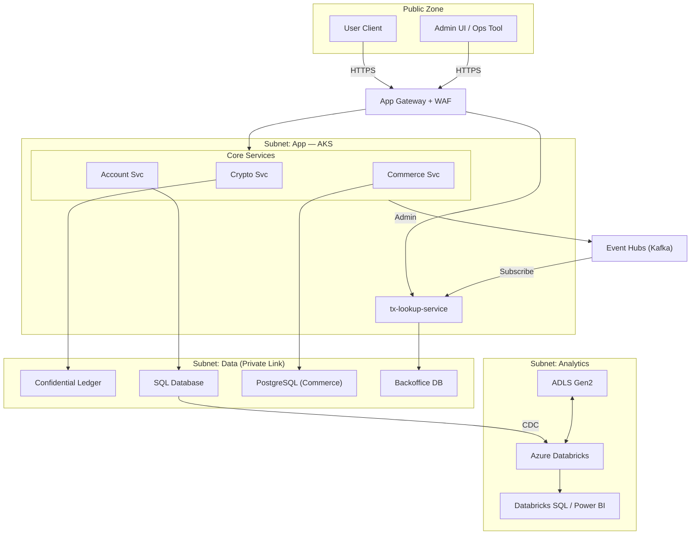
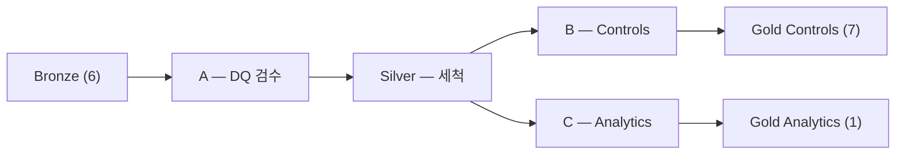
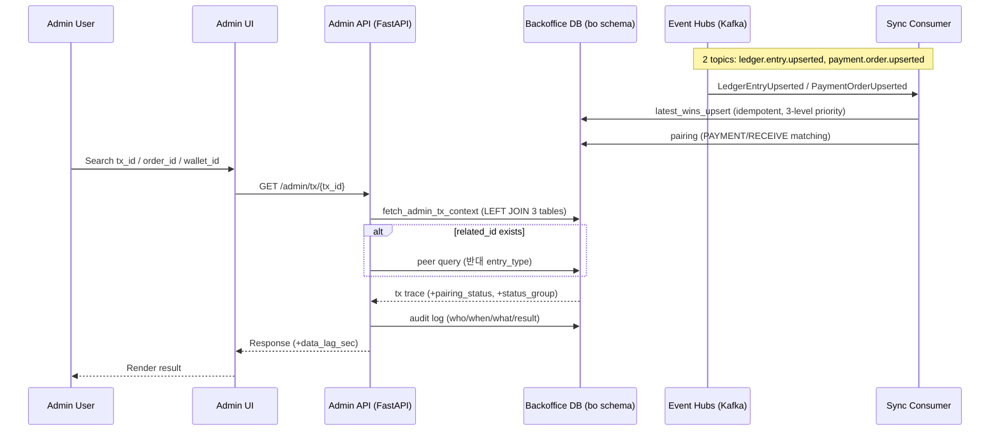

# Controls & Analytics Layer 아키텍처 (Azure) — NSC Platform (SRS 2.3/2.4)

> **Controls & Analytics Layer 정의(본 프로젝트)**: SRS **2.3(원장 및 관리자)**, **2.4(Analytics - OLAP)** 범위를 통칭  
> **Updated**: 2026-02-13
> **근거 문서(현재 디렉토리)**: `SRS - Software Requirements Specification.md`, `databricks_project_specs.md`, `data_contract.md`, `backoffice_project_specs.md`, `backoffice_db_admin_api.md`, `backoffice_data_project.md`, `database_schema`, `architecture_guide_databricks.md`, `architecture_guide_tx_lookup.md`, `entire_architecture_diagram.md`

---

## 1) 범위 / 시스템 경계

### 1.1 In-scope (Controls & Analytics Layer)

- **FR-ADM-01**: 총 발행량(issued supply) ↔ 사용자 잔액 총합 정합성(일배치 검증)
- **FR-ADM-02**: `tx_id` 기반 거래 내역 추적(초 단위 조회는 Serving Layer)
- **FR-ADM-03**: 일일 대사(Δ잔고 = 순흐름) 및 불일치 리포팅
- **FR-ANA-01(P3)**: 결제/주문 데이터 익명화 적재(OLAP)
- **FR-ANA-02(P3)**: 시세 모니터링(옵션)

### 1.2 Out-of-scope (업스트림/거래 처리 계층)

- Freeze/Settle/Rollback 등 **트랜잭션 처리** 및 ACID 원장 기록(SRS 2.1/2.2)
- 고객-facing 실시간 처리 SLA(Controls & Analytics Layer는 배치/준실시간 중심)

---

## 2) 요구사항 ↔ 구현 위치(요약)

| SRS | 요구사항 | 구현 위치 | Azure 주요 구성요소 | 핵심 산출물/인터페이스 |
|---|---|---|---|---|
| FR-ADM-01 | 발행량 ↔ 잔액 합 검증 | Lakehouse | ADLS Gen2 + Azure Databricks | `gold.ledger_supply_balance_daily`, `gold.exception_ledger` |
| FR-ADM-02 | `tx_id` 거래 추적(초 단위) | Serving | Event Hubs(Kafka) + Consumer + PostgreSQL + Admin API | `GET /admin/tx/{tx_id}`, `GET /admin/payment-orders/{order_id}`, `GET /admin/wallets/{wallet_id}/tx` |
| FR-ADM-03 | 일일 대사(자정) | Lakehouse | ADLS Gen2 + Azure Databricks | `gold.recon_daily_snapshot_flow`, `gold.exception_ledger` |
| FR-ADM-03+ | 운영 지표(일일) | Lakehouse | Azure Databricks | `gold.ops_payment_failure_daily`, `gold.ops_payment_refund_daily`, `gold.ops_ledger_pairing_quality_daily`, `gold.admin_tx_search` |
| FR-ANA-01 | 결제 패턴 수집(익명화) | Lakehouse | Databricks(ETL) + Databricks SQL/Power BI | `gold.fact_payment_anonymized` |
| FR-ANA-02 | 시세 모니터링 | Lakehouse(옵션) | Functions/AKS + Databricks | `gold.fact_market_price`(옵션) |

---

## 3) 전체 아키텍처(논리 뷰)



### 3.1 Azure 서비스로 운영할 때의 구성(운영 뷰)

운영 시에는 아래 조합을 기본값으로 둔다.

| 영역 | 논리 컴포넌트 | Azure 서비스 | 비고 |
|---|---|---|---|
| Lakehouse | 데이터 저장(Bronze/Silver/Gold) | **Storage Account (ADLS Gen2)** | Delta Lake 저장소(Private Endpoint) |
| Lakehouse | ETL/배치 실행 | **Azure Databricks (Workflows/Jobs)** | Unity Catalog 권한 분리, Workflows로 스케줄/재시도 |
| Lakehouse | SQL/리포팅 | **Databricks SQL** / **Power BI** | 운영 통제/OLAP 조회 |
| Ingestion | CDC | **SQL Database → Databricks (CDC)** | Account Svc OLTP → Databricks 직접 CDC |
| Ingestion | 스트리밍 | **Event Hubs (Kafka) → Databricks Streaming** | 이벤트 기반 Bronze 적재 |
| Upstream | 앱 실행 환경 | **AKS (Azure Kubernetes Service)** | Crypto Svc(Python FastAPI), Account Svc / Commerce Svc(Java Spring Boot) |
| Upstream | OLTP 데이터 | **Confidential Ledger** + **SQL Database** + **PostgreSQL** | 서비스별 전용 DB 분리 |
| Serving | 이벤트 소비/동기화 | **AKS** | Sync Consumer — 2 topics(`ledger.entry.upserted`, `payment.order.upserted`) |
| Serving | Admin API | **AKS** | FastAPI, 3 endpoints, OIDC JWT + RBAC(`ADMIN_READ`, `ADMIN_AUDIT`), 감사로그 |
| Serving | Serving DB | **Azure Database for PostgreSQL (Flexible Server)** | Backoffice DB — `bo` 스키마, 5 tables |
| Container | 이미지 저장 | **Azure Container Registry (ACR)** | CI/CD 산출물 |
| Identity | 인증/권한 | **Microsoft Entra ID(Azure AD)** | Admin SSO(OIDC), 서비스 간 Managed Identity |
| Secrets | 시크릿/가명처리 salt | **Azure Key Vault** | Databricks Secret Scope 연동 |
| Network | 단일 진입점(WAF) | **Application Gateway + WAF** | 단일 공개 진입점 원칙(확정) |
| Network | Private access | **Private Endpoint + Private DNS** | ADLS/KV/ACR/DB/Event Hubs 등 |
| Network | Egress 통제 | **UDR + Azure Firewall** | allowlist 기반 outbound |
| Ops | 운영자 접속 | **Azure Bastion** | 공인 IP 최소화 |
| Observability | 로그/메트릭/트레이싱 | **Azure Monitor + Log Analytics + Application Insights** | OTel 기반 중앙 수집/알림 |

---

## 4) Lakehouse(Controls & Analytics) — ADLS Gen2 + Azure Databricks

### 4.1 데이터 레이어

- **Bronze** (6개): 외부 시스템에서 들어온 JSONL 원본 데이터. 스키마 에볼루션 허용(원본 최대 보존)
- **Silver** (7개): `data_contract.md` 기반 스키마 강제 + DQ/격리(fail-fast/Quarantine)
- **Gold** (10개): 운영 통제 산출물 + 익명화된 분석 마트

#### 테이블 전체 목록

**Bronze (6개)**
`user_wallets_raw`, `transaction_ledger_raw`, `payment_orders_raw`, `orders_raw`, `order_items_raw`, `products_raw`

**Silver (7개)**
`wallet_snapshot`, `ledger_entries`, `order_events`, `order_items`, `products`, `bad_records`, `dq_status`

**Gold (10개)**

| 테이블 | 용도 | 생성 파이프라인 |
|--------|------|----------------|
| `recon_daily_snapshot_flow` | 유저별 일일 정산(Δ잔고 = 순흐름) | B-1 |
| `ledger_supply_balance_daily` | 발행량 ↔ 잔액 합 정합성 | B-2 |
| `ops_payment_failure_daily` | 머천트별 결제 실패율 | B-3 |
| `ops_payment_refund_daily` | 머천트별 환불율 | B-4 |
| `ops_ledger_pairing_quality_daily` | 원장 페어링 품질(related_id null, 쌍 완성율) | B-5 |
| `admin_tx_search` | 관리자 거래 검색용 플랫 인덱스(related_id 쌍 매칭) | B-6 |
| `exception_ledger` | DQ/통제 임계값 초과 예외 기록 | A, B |
| `pipeline_state` | 파이프라인 간 조율(last_success_ts, last_processed_end 등) | 전체 |
| `dim_rule_scd2` | 런타임 임계값/허용값 관리(SCD2 버전) | sync_rules |
| `fact_payment_anonymized` | 익명화 결제 팩트(PII 제거 + user_key 가명처리) | C |

### 4.2 Ingestion

- **CDC**: SQL Database(Account Svc OLTP) → Databricks 직접 CDC 연결
- **스트리밍**: Event Hubs(Kafka) → Databricks Streaming → Bronze 적재
- **백필**: JSONL 파일 기반 수동 백필 지원

### 4.3 Workflows/Jobs

#### 파이프라인 4개 요약

| 파이프라인 | 한 줄 요약 | 입력 | 출력 |
|-----------|-----------|------|------|
| **Silver** | Bronze를 세척해서 Silver로 | Bronze 6개 | Silver 6개 + `bad_records` |
| **A (Guardrail)** | Bronze 데이터 품질 검사 | Bronze 3개 | `silver.dq_status`, `gold.exception_ledger` |
| **B (Controls)** | 재무 정합성 + 운영 지표 | Silver + Bronze 일부 | Gold 7개 |
| **C (Analytics)** | 익명화 결제 팩트 | Silver 3개 | `gold.fact_payment_anonymized` |

#### 프로덕션 스케줄

프로덕션에서 각 파이프라인은 **독립된 Databricks Job**이다. Job 간 `depends_on`은 없고, 스케줄 시간 + 코드 레벨 체크(`assert_pipeline_ready`)로 순서를 보장한다.

```
00:00 KST  Silver — Bronze 6개 → Silver (어제 KST 날짜 데이터)
매 10분     A      — Bronze 3개 DQ 검사 (마이크로배치)
00:20 KST  B      — 정산/공급량/운영 지표 (어제 KST)
00:35 KST  C      — 익명화 팩트 (어제 KST)
```

E2E 테스트(`e2e_full_pipeline`)에서는 단일 워크플로우로 묶여 있다:
```
sync_rules → A → Silver → B, C (병렬)
```



#### Pipeline Silver — Bronze 세척기

Bronze 6개 테이블을 읽어서, 계약 기준으로 검증한 뒤 통과/불량을 분리한다.

| Bronze 입력 | Silver 출력 | 주요 검증 |
|------------|------------|----------|
| `user_wallets_raw` | `wallet_snapshot` | user_id 존재, 잔액 >= 0, `balance_total = available + frozen` 계산 |
| `transaction_ledger_raw` | `ledger_entries` | tx_id 존재, amount > 0, 유효한 entry_type, **`amount_signed` 계산** |
| `payment_orders_raw` + `orders_raw` | `order_events` | 두 테이블 UNION, `order_source` 태그 부착 |
| `order_items_raw` | `order_items` | ID 유효성 |
| `products_raw` | `products` | product_id 유효성 |
| (불량 레코드 전체) | `bad_records` | 위 검증 실패한 모든 행 |

**`amount_signed` 계산** — 원장 거래의 부호 방향:
```
CHARGE: +1,  RECEIVE: +1,  REFUND_IN: +1,  MINT: +1
PAYMENT: -1, WITHDRAW: -1, REFUND_OUT: -1, BURN: -1
HOLD: 0,     RELEASE: 0

amount_signed = amount × sign
```

**안전장치**: `enforce_bad_records_rate` — 불량률이 규칙 임계값을 넘으면 `RuntimeError` (fail-fast). 나쁜 데이터를 Silver에 넣느니 차라리 파이프라인을 멈추는 전략.

#### Pipeline A — DQ 검수원

Bronze 3개 테이블(`user_wallets_raw`, `transaction_ledger_raw`, `payment_orders_raw`)의 데이터 품질을 4가지 지표로 검사한다.

| 지표 | 의미 |
|------|------|
| `freshness_sec` | 가장 최근 레코드가 지금으로부터 몇 초 전인가 |
| `dup_rate` | 키 기준 중복 비율 |
| `bad_records_rate` | 계약 위반 비율 |
| `zero_windows` | 연속 빈 윈도우 횟수 |

**임계값은 코드에 하드코딩되어 있지 않다.** `gold.dim_rule_scd2` 테이블에서 런타임에 로드한다.

**판정 로직** (`_evaluate_severity`): `value >= warn → WARN`, `value >= crit → CRITICAL`

**DQ 태그 우선순위** (여러 지표가 동시에 걸리면 하나만 선택):
```
SOURCE_STALE > DUP_SUSPECTED > EVENT_DROP_SUSPECTED > CONTRACT_VIOLATION
```

**출력**: `silver.dq_status` (append), `gold.exception_ledger` (append, 조건부), `gold.pipeline_state` 업데이트

#### Pipeline B — 재무 정합성 + 운영 지표 (6가지 점검)

| 점검 | 산출물 | 내용 |
|------|--------|------|
| B-1 | `recon_daily_snapshot_flow` | 유저별 `drift_abs = \|delta_balance - net_flow\|` → 임계값 비교 |
| B-2 | `ledger_supply_balance_daily` | `\|total_issued - total_wallets\|` → 임계값 비교 |
| B-3 | `ops_payment_failure_daily` | 머천트별 FAILED/CANCELLED 건수 집계 (Bronze 직접) |
| B-4 | `ops_payment_refund_daily` | 머천트별 REFUNDED 건수 집계 |
| B-5 | `ops_ledger_pairing_quality_daily` | related_id null 비율, 2건 페어 비율, 주문 매칭 비율 |
| B-6 | `admin_tx_search` | 원장 거래를 related_id로 쌍 매칭한 플랫 인덱스 |

B-1/B-2는 A가 쓴 `dq_tag`가 `SOURCE_STALE`이나 `EVENT_DROP_SUSPECTED`이면, 임계값 판정을 **억제**하고 결과에 태그를 첨부한다 (소프트 게이팅).

#### Pipeline C — 익명화 결제 팩트

```
silver.order_events (PAYMENT_ORDERS만 필터)
  + silver.order_items (주문별 상품)
  + silver.products (상품 카테고리)
  ↓
주문별 "대표 카테고리" 선정 (price × quantity가 가장 큰 상품)
  ↓
user_id → SHA-256(user_id + salt) → user_key
  ↓
gold.fact_payment_anonymized (overwrite_partitions — 해당 날짜만 교체)
```

Salt 해소 순서: Databricks Secrets → 환경변수 → 로컬 더미(`local-salt-v1`).

### 4.4 게이팅 메커니즘

#### 하드 게이트 — 코드 레벨 (`assert_pipeline_ready`)

B와 C는 시작 시 `gold.pipeline_state`에서 **`pipeline_silver`** 완료를 확인한다.

```
체크 3단계:
1. pipeline_state 테이블 존재?
2. pipeline_name = "pipeline_silver" 행 존재?
3. last_success_ts non-null & last_processed_end >= 요구 시점?

하나라도 실패 → UpstreamReadinessError → 즉시 중단
```

| 파이프라인 | 하드 게이트 대상 |
|-----------|----------------|
| Silver | 없음 — Bronze 직접 읽음 |
| A | 없음 — Bronze 직접 읽음 |
| **B** | **pipeline_silver** |
| **C** | **pipeline_silver** |

#### 소프트 게이트 — 데이터 레벨 (dq_tags)

```
A가 dq_tag 생성 → silver.dq_status에 기록
                        ↓
B가 읽어서 → SOURCE_STALE 또는 EVENT_DROP_SUSPECTED면
           → 정산/공급량 결과에 태그 첨부 + 임계값 판정 억제
```

C는 `dq_status`를 읽지 않으므로 소프트 게이트 영향을 받지 않는다.

#### 프로덕션 vs E2E 차이

| 항목 | 프로덕션 | E2E 테스트 |
|------|---------|-----------|
| 실행 단위 | 각 파이프라인이 독립 Job | 단일 워크플로우 |
| 순서 보장 | 스케줄 시간 + `assert_pipeline_ready` | Databricks `depends_on` DAG |
| A-Silver 순서 | 독립 (A는 10분 주기, Silver는 일 1회) | A → Silver (순차) |

### 4.5 `pipeline_state` 테이블 구조

파이프라인 간 조율의 중심 테이블:

```
pipeline_name         "pipeline_a" | "pipeline_silver" | "pipeline_b" | "pipeline_c"
last_success_ts       마지막 성공 시각 (UTC)
last_processed_end    마지막 처리 완료 윈도우 끝 (UTC) — B/C 하드 게이트가 이걸 체크
last_run_id           마지막 실행 ID
dq_zero_window_counts JSON 문자열 — A만 사용 (연속 빈 윈도우 카운트)
status                "success" | "failure"
```

### 4.6 Delta 쓰기 전략

| 전략 | 대상 | 동작 |
|------|------|------|
| `merge` | Gold 대부분, Silver 전체 | merge key 기준 UPSERT |
| `overwrite_partitions` | `fact_payment_anonymized`만 | 해당 `date_kst` 파티션만 통째로 교체 |
| `append` | `silver.dq_status`, `gold.exception_ledger`, `silver.bad_records` | 기존 데이터 유지 + 새 행 추가 |

### 4.7 코드 구조

```
src/
├── transforms/   ← 순수 계산 로직 (Spark, DB 의존 없음, dict → dict)
├── io/           ← Delta Lake 읽기/쓰기만 담당
├── jobs/         ← transforms + io를 Spark DataFrame으로 조립 (진입점)
└── common/       ← 설정, 시간, 규칙, 계약 등 공유 유틸
```

주요 공통 모듈: `contracts.py`(23개 스키마 계약), `rules.py`(런타임 임계값), `job_params.py`(incremental/backfill 파라미터), `time_utils.py`(UTC/KST 변환), `table_metadata.py`(Delta 쓰기 설정), `config_loader.py`(YAML 설정), `run_tracking.py`(run_id 추적)

### 4.8 확장 전략(OLAP 요구사항 추가 시)

- OLAP(Analytics) 영역은 **아이디어/지표 논의(운영·비즈니스 질문 정의) 후** 우선순위를 확정하고 단계적으로 확장한다.
- 새로운 OLAP 분석 요구사항이 생기면 **Gold 레이어에 테이블(또는 뷰)을 추가**하여 확장한다.
  - 예: 신규 팩트/집계(`gold.fact_*`, `gold.mart_*`) 또는 신규 차원(`gold.dim_*`)
- 기존 Silver 계약(`data_contract.md`)은 가능한 한 **안정적으로 유지**하고, Gold에서 파생/조합을 통해 요구사항을 흡수한다.
- Gold 확장 시 운영 원칙
  - 스키마는 고정(계약 기반)하고, 변경은 버전업(필요 시 SCD2/룰 버전)으로 관리
  - PII 미적재/가명처리 원칙 준수(`user_key`, `salt`는 Key Vault)
  - Unity Catalog 권한을 “운영 통제 산출물”과 “분석 마트”로 분리(접근 최소화)
  - Databricks Workflows(Pipeline C)에 Job/Task를 추가하고, DAB로 환경별 배포(IaC)

---

## 5) Serving Layer(FR-ADM-02) — tx-lookup-service

### 5.1 서비스 범위

```
OLTP DB → Kafka/Event Hubs → [Sync Consumer] → Backoffice DB → [Admin API] → Admin UI
                               ^^^^^^^^^^^^^^^^^^^^^^^^^^^^^^^^^^^^^^^^^^^^^^^^
                               tx-lookup-service 범위 (consumer-only, producer 아님)
```

### 5.2 구성요소

- **Event Bus**: Azure Event Hubs (Kafka endpoint) — 2개 토픽 구독
- **Sync Consumer**: 이벤트 consume → Backoffice DB에 `latest_wins_upsert`(멱등) + 페어링 + DLQ
- **Backoffice DB**: Azure Database for PostgreSQL Flexible Server — `bo` 스키마, 5개 테이블
- **Admin API**: FastAPI, 3개 엔드포인트, OIDC JWT + RBAC, 감사로그

### 5.3 엔드포인트

| 메서드 | 경로 | 동작 | 응답 |
|--------|------|------|------|
| `GET` | `/admin/tx/{tx_id}` | 거래 단건 조회 | 200 / 404 |
| `GET` | `/admin/payment-orders/{order_id}` | 주문 기준 조회 | 200 / 404 |
| `GET` | `/admin/wallets/{wallet_id}/tx?from=&to=&limit=` | 지갑 거래 목록 | 200 (빈 목록이어도 200) |

### 5.4 Backoffice DB 스키마 (`bo`)

| 테이블 | PK | 역할 | Writer |
|--------|------|------|--------|
| `bo.ledger_entries` | `tx_id` | 원장 엔트리 파생 저장소 | Consumer |
| `bo.payment_orders` | `order_id` | 결제 오더 파생 저장소 | Consumer |
| `bo.payment_ledger_pairs` | `payment_order_id` | PAYMENT/RECEIVE 페어링 상태 | Consumer |
| `bo.admin_audit_logs` | `audit_id` (auto) | 관리자 조회 감사 기록 | API |
| `bo.consumer_dlq_events` | `dlq_id` (auto) | Consumer 실패 이벤트 DLQ | Consumer |

핵심 관계: `ledger_entries.related_id → payment_orders.order_id → payment_ledger_pairs.payment_order_id`

인덱스: `ledger_entries`(`related_id`, `(wallet_id, event_time)`, `event_time`), `payment_orders`(`user_id`, `merchant_name`, `status`, `created_at`), `admin_audit_logs`(`requested_at`, `resource_id`, `(resource_id, requested_at)`)

### 5.5 이벤트 계약 및 Consumer

**2개 토픽 구독**:

| 토픽 | 이벤트 타입 | 필수 필드 |
|------|-----------|----------|
| `ledger.entry.upserted` | `LedgerEntryUpserted` | `tx_id`, `wallet_id`, `entry_type`, `amount`, `event_time` |
| `payment.order.upserted` | `PaymentOrderUpserted` | `order_id`, `amount`, `status`, `created_at` |

**멱등 upsert (`latest_wins_upsert`)** — PostgreSQL `ON CONFLICT DO UPDATE`:
```
우선순위 3단계:
1. updated_at 비교: incoming.updated_at >= existing.updated_at → 업데이트
2. source_version 비교: updated_at 없고, incoming.version >= existing.version → 업데이트
3. Fallback (ingested_at): 양쪽 모두 NULL일 때만 ingested_at 비교
```

**페어링 로직**: `related_id`로 `ledger_entries` 조회 → PAYMENT + RECEIVE 엔트리 매칭 → `should_update_pair()` 체크(complete→incomplete 업데이트 차단 = 회귀 방지) → `bo.payment_ledger_pairs` upsert

**DLQ 전략**: 처리 실패 시 DLQ 저장(DB 또는 JSONL) + 원본 commit(poison pill 방지). 14일 보관, `scripts/replay_dlq.py`로 수동 재처리.

**백필 CLI**: `python -m src.consumer.main backfill --ledger-file data.jsonl`

### 5.6 인증/인가

```
AUTH_MODE=disabled → 로컬 개발용 (인증 없음)
AUTH_MODE=oidc     → JWT 검증 + 역할 체크

역할: ADMIN_READ 또는 ADMIN_AUDIT (둘 중 하나면 접근 허용)
actor_id: oid 우선, 없으면 sub (Entra ID 기준)
```

### 5.7 코드 구조

```
src/
├── api/         ← Admin API (FastAPI 엔드포인트, 인증, 감사, 스키마)
├── consumer/    ← Kafka Consumer (이벤트 파싱, 처리, 페어링, DLQ)
├── db/          ← DB 레이어 (모델, 쿼리, 멱등 upsert)
└── common/      ← 공통 인프라 (설정, 로깅, 메트릭, OTel)
```

**분리 원칙**: `api/`와 `consumer/`는 서로를 import하지 않는다. 둘 다 `db/`와 `common/`만 의존한다.

### 5.8 데이터 흐름(요약)



---

## 6) 보안/네트워크/거버넌스(권장 베이스라인)

### 6.1 Identity & Secrets

- **Azure AD (Entra ID)**: Admin 사용자 SSO(OIDC) + RBAC(`ADMIN_READ`, `ADMIN_AUDIT`)
- **Managed Identity**: Databricks/AKS → Key Vault, ADLS, DB 접근
- **Key Vault**: DB 커넥션/브로커 크리덴셜 + 익명화 `salt` 저장
  - Databricks는 Secret Scope(Key Vault backed)로 참조


### 6.2 데이터 거버넌스

- **Unity Catalog**: bronze/silver/gold 권한 분리(특히 분석 마트/운영 통제 산출물 분리)
- Analytics는 PII 미적재 원칙 + `user_key` 가명처리(`sha2(user_id + salt)`)

---

## 7) 관측/알림(운영 필수)

### 7.1 Databricks 관측

- Job 성공/실패, 재시도, 실행시간, 입력 데이터 신선도/중복률(DQ)
- `gold.exception_ledger`에 `severity=CRITICAL` 적재 시 알림 트리거(Teams/Slack/Email 등)
- Job 로그 → Log Analytics 전송

### 7.2 Serving 메트릭 (OTel → Azure Monitor)

| 영역 | 메트릭 |
|------|--------|
| API | `api_request_latency_seconds`, `api_requests_total`, `api_requests_inflight` |
| Consumer | `consumer_messages_total`, `consumer_event_lag_seconds`, `consumer_kafka_lag`, `consumer_freshness_seconds`, `consumer_dlq_total` |
| Pairing | `pairing_total`, `pairing_incomplete_total`, `pairing_incomplete_age_seconds`, `pairing_skipped_non_payment_order_total` |
| DB | `db_query_latency_seconds`, `db_pool_size`, `db_pool_checked_out`, `db_pool_checkout_latency_seconds`, `db_replication_lag_seconds` |

**상관관계 추적**: `X-Correlation-ID` 헤더 — API 응답, Consumer Kafka 헤더, 로그에 전파

### 7.3 Serving 알림 규칙

| 규칙 | 심각도 | 조건 |
|------|--------|------|
| `ApiLatencyHigh` | WARNING | p95 > 200ms / 5m |
| `ApiErrorRateHigh` | WARNING | 4xx+5xx > 2% / 5m |
| `DataFreshnessHigh` | CRITICAL | freshness > 5s / 5m |
| `DlqActivity` | WARNING | DLQ 건수 > 0 / 5m |
| `DbPoolExhausted` | WARNING | pool 고갈 |
| `DbReplicationLagHigh` | CRITICAL | lag > 10s / 5m |

### 7.4 Perimeter/Egress

- App Gateway WAF 로그, Firewall 네트워크 로그, 차단 이벤트 → Log Analytics
- allowlist 변경 이력(운영 감사)

### 7.5 공통

- Log Analytics + App Insights로 로그/메트릭 통합, Action Group으로 알림 라우팅

---

## 8) CI/CD & 환경 분리

- 환경: `dev` / `prod` 최소 2개(권장 3개: `local/dev/prod`)
- IaC: Terraform/Bicep로 네트워크/DB/Event Hubs/Key Vault/모니터링 프로비저닝
- Databricks 배포: **Databricks Asset Bundles(DAB)**로 Jobs/Workflows/권한을 환경별로 배포
- Serving 배포: GitHub Actions/Azure DevOps → 컨테이너 빌드/스캔 → ACR push → AKS 롤링 배포

---
